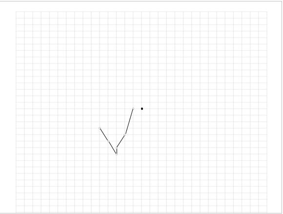

## Do Now 1.1 Cartesian Coordinate Plane Review

Using the graph paper provided, draw the Cartesian Coordinate plane. Include the following,
* x-axis
* y-axis
* Origin
* x - Minimum = -15
* y - Minimum = -15
* x - Maximum = 15
* y - Maximum = 15

## Connect the dots...
>Using the Coordinates below connect the points to see what they create. Hint: Have you seen Red?

Curve 1 Begins;
(-5, -3);
(-4, -5);
(-3, -7);
(-3, -6);
(-2, -4);
(-1, 0);
Curve Ends

Curve 2 Begins;
(-7, 1);
(-8, 4);
(-9, 7);
(-8, 10);
(-7, 10);
(-5, 9);
(-3, 7);
(-2, 6);
(0, 7);
(2, 6);
(3, 7);
(5, 9);
(7, 10);
(8, 10);
(9, 7);
(8, 4);
(7, 1);
(3, 4);
(0, 1);
(-3, 4);
(-7, 1);
Curve Ends

Curve 3 Begins;
(-5, 0);
(-4, 0);
(-2, -1);
(-4, -1);
(-5, 0);
Curve Ends

Curve 4 Begins;
(5, -3);
(4, -5);
(3, -7);
Curve Ends

Curve 5 Begins;
(7, 1);
(8, -3);
(9, -7);
(8. -7);
(7. -6);
(4, -9);
(1, -10);
(-1, -10);
(-4, -9);
(-7, -6);
(-8, -7);
(-9, -6);
(-8, -2);
(-7, 1);
Curve Ends

Line 6 Begins;
(5, 0);
(4, -1);
(2, -1);
(4, 0);
(5, 0);
Curve Ends

Curve 7 Begins;
(1, 0);
(2, -4);
(3, -6);
(3, -7);
(1, -8);
Curve Ends

Curve 8 Begins;
(-4, -1);
(-4, 0);
(-3, -1);
Shade In Area;
Curve Ends

Curve 9 Begins;
(-3, -7);
(-1, -8);
(1, -8);
(2, -6);
(1, -5);
(-1, -5);
(-2, -6);
(-1, -8);
Shade In Area;
Curve Ends

Curve 10 Begins;
(4, 6);
(7, 9);
(7, 5);
(6, 4);
(4, 5);
(4, 6);
Shade In Area;
Curve Ends

Curve 11 Begins;
(4, -1);
(4, 0);
(3, -1);
Shade In Area;
Curve Ends

Curve 12 Begins;
(-7, 4);
(-7, 9);
(-4, 6);
(-4, 5);
(-6, 3);
(-7, 4);
Shade In Area;
Curve Ends

## Example Including Curve 1

