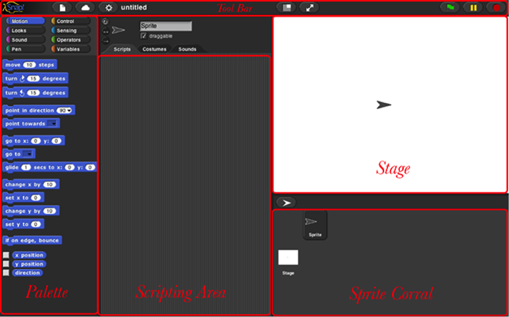

# Lab 1.1 - Welcome To Snap!

Snap is a programming language, which you can use to tell a computer what to do. A program is a particular set of instructions for the computer to follow.

Programs in most languages use only letters (and punctuation), but snap is different: it's a visual language. Instead of writing a program only using the keyboard, you will drag pictures of blocks and click them together.

>The following is a program in Snap!: 

>

>**Can you guess what it might do? (Write your guess below)**
 
>---

Snap is different than many other languages in another way— you run it in a web browser like Firefox or Chrome. The url that you can use to always get to Snap! is

**http://snap.berkeley.edu/run**

In order to save your programs, the first thing you'll need to do is make an account. In the snap browser window, Find the cloud-shaped button in the top toolbar on the upper left corner of the window:

Click it, select the "sign up" option in the menu, and follow the instructions there. You will need to check your email after creating your account to get your initial password.

## 1. Overview of the Window

You may have noticed that there are a few main sections of the Snap! window. These regions are named as shown below. 

## 2. Blocks
The area at the left edge of the window is the palette. As you see in the picture, it contains tabs for eight different-color block categories. In this lab, we will focus on the Motion, Sound, Pen, and Sensing tabs. You will learn about the other tabs in the next few labs. 

These tabs are an important organizational structure in snap because they are home to the various blocks that you will use to tell the computer what to do. The blocks are categorized under each tab based on what kind of thing each block does. 

> **2.1) Below, fill in the name of the category to which each block belongs:**

> | Block | Category |
  | -- | -- |
  | |  |
  | |  |
  | |  |
  | |  |
  | |  |
  | |  |
  | |  |
  | | &nbsp; |
  
Look at the **Motion** tab. Under this tab you will find a bunch of blocks that correspond to motion-like actions. For example, click on the  block, drag it to the scripting area, and drop it anywhere in the scripting area.

  
The block that you just dragged and dropped into the scripting area controls something that we call a sprite, which is the arrowhead-looking thing in the middle of the stage (the white part of the window).

>Back to the scripting area, if you click on the  you just put there, the sprite will move 10 steps. You can see this visually depicted by the sprite moving in the stage. You can vary the input of the block, i.e., the number 10, to change the number of steps you want to the sprite to move.

>2.2) How can you change the block input so that the sprite moves in the opposite direction?
 
--

##Part 3. Scripts
Now that you have figured out how to make a sprite move, you might be wondering how to make the sprite do other things as well. 
To make a sprite do more than just move, we need to use different types of blocks and link them together. You can link blocks by snapping (hence the name snap) them together -- drag a block right underneath the one to which you want to attach it. Blocks will snap together when one block’s indentation is near the tab of the one above it. You should see a white bar appear like the one in the image below, which just shows you where the block will go after you drop it. 

If you keep attaching blocks together in this way, you will create a script. A snap program consists of one or more of these scripts.

>**3.1) Try recreating the following script in the scripting area in snap.**

> The purple say... blocks are available from the **Looks** tab.

Remember, a script will tell the sprite what to do. Click on the script and see what happens! You will know that your script is running if it has a highlighted border around it: 

>**3.2) What happens when you run this script?**
 
---

>Be sure to note: **blocks in a script run in a specific order, from the top of the script to the bottom**. Generally, snap waits until one block has finished its job before continuing on to the block below it. (One common exception is blocks that play sounds: a block's job can be to start the sound, which means the block below it will execute while the sound is still playing. 
