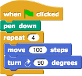
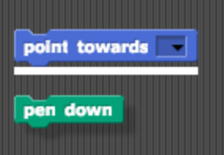
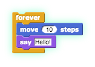
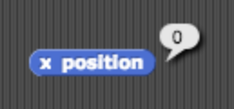
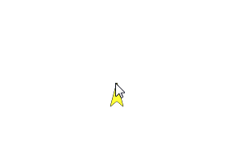

# Lab 1.1 - Welcome To Snap!
_Adapted from Beauty and Joy of Computing: http://bjc.eecs.berkeley.edu/bjc-r/topic/topic.html?topic=berkeley_bjc/intro_new/1-introduction.topic_

SNAP is a programming language, which you can use to tell a computer what to do. A program is a particular set of instructions for the computer to follow.

Programs in most languages use only letters (and punctuation), but snap is different: it's a visual language. Instead of writing a program only using the keyboard, you will drag pictures of blocks and click them together.

>The following is a program in Snap!: 

>

>**Can you guess what it might do? (Write your guess below)**
<br />
>---

Snap is different than many other languages in another way— you run it in a web browser like Firefox or Chrome. The url that you can use to always get to Snap! is

**http://snap.berkeley.edu/run**

In order to save your programs, the first thing you'll need to do is make an account. In the snap browser window, Find the cloud-shaped button in the top toolbar on the upper left corner of the window:


Click it, select the "sign up" option in the menu, and follow the instructions there. You will need to check your email after creating your account to get your initial password.


## 1. Overview of the Window

You may have noticed that there are a few main sections of the Snap! window. These regions are named as shown below. 


## 2. Blocks
The area at the left edge of the window is the palette. As you see in the picture, it contains tabs for eight different-color block categories. In this lab, we will focus on the Motion, Sound, Pen, and Sensing tabs. You will learn about the other tabs in the next few labs. 

These tabs are an important organizational structure in snap because they are home to the various blocks that you will use to tell the computer what to do. The blocks are categorized under each tab based on what kind of thing each block does. 

> **2.1) Below, fill in the name of the category to which each block belongs:**

> | Block | Category |
  | -- | -- |
  | |  |
  | |  |
  | |  |
  | |  |
  | |  |
  | |  |
  | |  |
  | | &nbsp; |
  
Look at the **Motion** tab. Under this tab you will find a bunch of blocks that correspond to motion-like actions. For example, click on the  block, drag it to the scripting area, and drop it anywhere in the scripting area.


  
The block that you just dragged and dropped into the scripting area controls something that we call a sprite, which is the arrowhead-looking thing in the middle of the stage (the white part of the window).

>Back to the scripting area, if you click on the  you just put there, the sprite will move 10 steps. You can see this visually depicted by the sprite moving in the stage. You can vary the input of the block, i.e., the number 10, to change the number of steps you want to the sprite to move.

>2.2) How can you change the block input so that the sprite moves in the opposite direction?
<br />
--


##Part 3. Scripts
Now that you have figured out how to make a sprite move, you might be wondering how to make the sprite do other things as well. 
To make a sprite do more than just move, we need to use different types of blocks and link them together. You can link blocks by snapping (hence the name snap) them together -- drag a block right underneath the one to which you want to attach it. Blocks will snap together when one block's indentation is near the tab of the one above it. You should see a white bar appear like the one in the image below, which just shows you where the block will go after you drop it. 



If you keep attaching blocks together in this way, you will create a script. A snap program consists of one or more of these scripts.

>**3.1) Try recreating the following script in the scripting area in SNAP.**

> 

> The purple say... blocks are available from the **Looks** tab.

Remember, a script will tell the sprite what to do. Click on the script and see what happens! You will know that your script is running if it has a highlighted border around it: 



>**3.2) What happens when you run this script?**

> 
<br />
--

>Be sure to note: **blocks in a script run in a specific order, from the top of the script to the bottom**. Generally, snap waits until one block has finished its job before continuing on to the block below it. (One common exception is blocks that play sounds: a block's job can be to start the sound, which means the block below it will execute while the sound is still playing. 


##Part 4: Reporters
At the bottom of Motion palette are three blocks shaped differently from the others. The oval-shaped  and  are called *reporters*. (We don't need the third one right now.) Unlike the jigsaw-puzzle-piece-shaped command blocks we've used until now, reporters don't carry out an action (such as moving the sprite or displaying a speech balloon) by themselves. Instead they report a value, usually for use in another block's input slot. 

These particular reporters tell you where the sprite is on the stage. As in algebra class, **x** means left-to-right position, and **y** means bottom-to-top position. 


>Drag your sprite to the far right side of the stage. Next, drag an x position block into the scripting area and click on it. You should see a little speech balloon next to the block: 

>

>4.1) What value does the x position block report to you when the sprite is...
...at the far right side of the stage:

>---
...in the center of the stage:

>---
...at the far left side of the stage:

>---

Click on the gray box to the left of the **x position block** in the palette, and then look over to the stage. You will see that the value that the block would report is displayed on the stage: 


       
This on-stage display is called a *watcher*.

The  and  the  will tell you the position of your sprite on the screen. Move the sprite around and the values reported by these blocks change. 

##Part 5: Position On The Stage
A sprite occupies a position (x,y) on the stage where x represents the horizontal position, from -240 (left) to 240 (right), and y represents the vertical position, from -180 (bottom) to 180 (top). Here's a picture: 


The purple sprite is at the center of the stage, called the origin, with coordinates (0, 0). The green sprite is to the right of the origin, so its x position is positive. The green sprite is also below the origin, so its y position is negative. Each grid line above represents 20 steps, so the green sprite's coordinates are (140, -100). Take some time to make sure you understand this; discuss it with a classmate.

>5.1) What are the coordinates of the red sprite?

>---

>In your *Snap!* window, take a look at the blocks under the Motion tab. The majority of the blocks there will help you position your sprite on the stage. Try them and see what they do! Change the input values to see what happens.

>5.2) List at least 4 blocks from the Motion tab that will change the position of a sprite: 

>---


##Part 6: Experiment with Drawing Commands
Try to get comfortable with the blocks under the Motion tab and the Pen tab. Figure out what each one does and try to use these blocks to draw a square or a simple picture. 

>6.1) What do these blocks do? (write an explanation next to each block)

>

>

>

>

>

>6.2) Does the *turn* block change the sprite's x and/or y position?
>___
>6.3) Using these blocks, draw a square. Write the code (blocks) you used below:
<br />
<br />
<br />
<br />
<br />
<br />
<br />
<br />


*Tips and Tricks:*

Once the pen is down, it stays down even in a different script. Use the pen up block to lift the pen so that no lines will be drawn.

You also will want to show the direction and x and y position of the sprite. In the Motion tab, you can select for these to be shown on the stage as described in the reporters activity you saw earlier in the lab.


##Part 7: Follow that Mouse!
>

>7.1) *What do you think the script above will do?*

>Hint:  and  are reporters in the Sensing palette; they tell you where the mouse is pointing. 
<br />
<br />
<br />
<br />

>Copy the code into SNAP, and click on the ```forever``` block to run it.

>**Did it follow your expectations (Yes/No)?**

>---
7.2) What happens when you drag the mouse to a different part of the screen while the program is running?
<br />
<br />
<br />
<br />


>7.3) How does program's behavior change when you modify the ```go to``` block as shown below? 

>
<br />
<br />
<br />
<br />

## Part 8: Forever and a Day
From the previous exercise, you may have figured out what the  block does. The ```forever``` block is the first block you have seen that holds, or wraps around, other blocks. We call this a *C block* because of its shape. As the name ```forever``` implies, it will run the blocks inside it again and again and again and ... well, forever. You will find this block under the **Control** tab. 
 
Will a  block ever stop? 

Not unless you tell it to: Click on the stop sign icon on the upper right hand corner of the Snap! window. 


 
This stop sign will stop all scripts that are running in any sprite. This is equivalent to executing the  in the Control palette.


### Check for Understanding
8.1) **How many times will the sprite say "Hello"? <br />**


a) 1 <br />
b) 2 <br />
c) 10 <br />
d) continuously <br />

8.2) **Assuming the sprite starts in the middle of the stage and pointing in direction 90, where would it end up after running this script?** <br />


a) Farther right on the stage <br />
b) Farther left on the stage <br />
c) Off the stage to the right <br />
d) Off the stage to the left <br />

8.3) **What would appear on the screen when this script is run?** <br />


a) The sprite would say "Tiger" forever <br />
b) The sprite would say "Tiger" then "Panda" once <br />
c) The sprite would alternate between saying "Tiger" and "Panda" forever <br />
d) The sprite would say "Tiger" and "Panda" at the same time forever. <br />

8.4) **Assuming the sprite started in the middle of the stage facing right, what kind of drawing would the sprite make?** <br />


a) a circle <br />
b) a dot <br />
c) a cylinder <br />
d) a straight line <br />

## Part 9: Make a Kaleidoscope
Explore this drawing program for a little bit (http://tinyurl.com/SnapKaleidoDraw). Press the spacebar to run the program, and move your mouse cursor over the stage of the Snap! window. While over the stage, use the **d** (pen down), **u** (pen up), and **c** (clear) keyboard keys to change what gets drawn on the screen. The script that causes the sprite to follow the pointer is 


 
As you can see, this drawing program features more **Control** blocks, in addition to the ```forever``` block first introduced in the *Follow the Mouse activity*. These *hat*-shaped block, which can be used only at the beginning of a script, indicate when a specific script should be run. 

>For this activity, your job is to make a (kind of) kaleidoscope, like: 

>
    
>The kaleidoscope consists of 4 sprites. Each sprite will be drawing with a different pen color. Each sprite's movement is based on the movement of the mouse. The first sprite follows the mouse, just like in the example we looked at before. The other 3 sprites move around as the mouse moves, but reflected over the X and Y axes.

>**Don't forget to save and submit your work!**

Some tips: 

* You will need four sprites. (We haven't used more than one sprite up to now, but having more than one allows for more interesting projects, as you'll see.) The easiest way to create three more is to *duplicate* the one you have. Right-click the sprite in the sprite corral, and select **duplicate** from the *context menu* that appears. Each duplicated sprite will have exactly the same scripts as the original, which is why we suggest duplication rather than just creating more sprites from scratch. 

* You can change the color of each sprite by clicking the color input in that sprite's   block (found under the **Pen** tab), choosing a color, and then clicking on the block itself (to run the block and actually set the color). Don't worry about matching the colors in the animation exactly! 

* Pay close attention to what each of the other sprites is doing in the animation above. You will need to modify the **x** and **y** inputs in each sprite's  block using simple formulas, with  and  . 

  **Hint: All the sprites are reflecting in different ways around the (x=0, y=0) origin point of the stage.**
* Once you figured this out, try out some complicated formulas and/or more sprites, and share with your classmates! 
