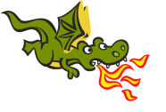

# Sprites in action

In this lab, you will use costumes and movement to create simple animations.

## Part 1: Run, Spot, run

1. In a new project, click on the file menu, then click costumes.  Import the costumes `dog2a` and `dog2b`.

    
    `dog2a`
    
    `dog2b`

2. Write a script to make the sprite change costume each time the space bar is pressed. (The sprite should switch back and forth between the two costumes.)

3. Add to your script so that when the left arrow is pressed the sprite

    * Face to the left.
    * Move a few steps.
    * Change costume when the `left arrow` key is pressed.

    _In your window, the dog should look like it is walking when you press the left arrow key repeatedly._

4. Enhance your script to look as though the dog can walk to the right when you click the `right arrow` key.

## Part 2: Dragons

1. Create a new sprite. Following the same steps as in part 1, import the costumes `dragon1-a` and `dragon1-b`.

    
    `dragon1-a`
    
    `dragon1-b`

2. Write a script to make the sprite appear to breathe fire when the `f` key is pressed.  The sprite should switch to the `dragon1-b` costume for a few seconds, then switch back to the `dragon1-a` costume.

3. Modify your script so that the dragon `attacks` the mouse pointer when the `f` key is pressed. When the `f` key is pressed, the dragon should take the following actions in order:

    1. Make sure it is in the `dragon1-a` costume.
    2. Point at the mouse pointer.
    3. Glide to the mouse pointer's position.
    4. Change to the `dragon1-b` costume
    5. Pause to breathe fire.
    6. Change back to the `dragon1-a` costume

## Part 3: Run away

1. Add another sprite to your program.  (This sprite can have any costume you choose).

2. Write a script to make this new sprite point away from the dragon and move when the `r` key is pressed.

3. Using the **broadcast** and **when I receive** blocks, modify your script so that instead of moving when the `r` key is pressed, the new sprite moves when the dragon attacks.  The fleeing sprite should move when the dragon starts breathing fire.

4. Add a second sprite that runs away from the dragon as well.

5. Save your project as _lab14_.

## Grading rubric

| **Criteria**   |  Points   |
| :------------------ | :--- |
| 2.2 Dragon breathes fire | 0.25 |
| 2.3 Dragon attacks mouse pointer correctly  | 0.75 |
| 3.2 A sprite runs away from dragon  | 0.25  |
| 3.3 Sprite runs away when dragon breathes fire  | 0.25 |
| 3.3 Use of the `broadcast` and `when I receive` blocks  | 0.25 |
| 3.4 Another sprite runs away too  | 0.25 |
| **Total** | **2.0** |
