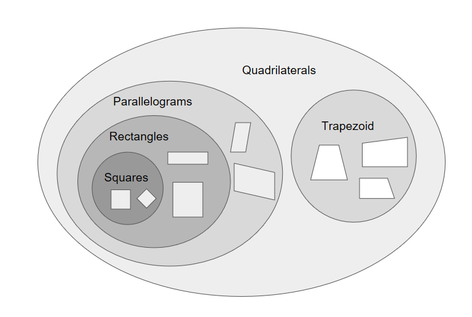

<!-- REVISED -->
# Lab 2.3 - What Shape is That

In this lab, you will use user input and conditional statements to identify shapes based on the number of sides and some other properties as given by the user.

## Part 1 - Triangle...or no triangle

1. Write a SNAP program that asks the user to think of a shape and input how many sides it has.  Then, if the user is thinking of a triangle, tell him or her so.  Regardless of whether or not the shape was a triangle, thank the user for playing.

2. Modify your program to give an appropriate message both when the user _is_ thinking of a triangle and when he or she is _not_ thinking of a triangle.  Give the same thank you message afterward in either case.

## Part 2 - Name That Polygon

You will now expand your program from above so that instead of just deciding if a shape is a triangle or not, your program will be able to name the specific polygon.  Your program must be able to identify at least the following shapes:  

| _Number of sides_ | _Polygon name_ |
| ----------------- | -------------- |
| 3                 | Triangle       |
| 4                 | Quadrilateral  |
| 5                 | Pentagon       |
| 6                 | Hexagon        |
| any other number  | Unknown        |

1. Fill out a [Planning Worksheet](https://tealsk12.gitbooks.io/introduction-to-computer-science/content/SNAP%20Program%20Design%20and%20Planning%20Worksheet.docx) for the above program.  Make sure you consider all aspects of the program carefully.

2. Write the program.  Be sure that your program works correctly in all cases.

## Part 3 - Quadrilateral Fever

Quadrilaterals come in many different varieties.  Add code to your program so that, if the user is thinking of is a quadrilateral, you ask more questions to find out which type of quadrilateral it is.  Your program should give the most specific name that applies.  The following table describes the quadrilaterals you should know about from most to least specific:

| _Property_                                                                    | _Quadrilateral name_  |
| ----------------------------------------------------------------------------- | --------------------- |
| All four sides have the same length and all four angles have the same measure | Square                |
| Not a square and all four angles have the same measure                        | Rectangle             |
| Not a rectangle and each side is parallel to one other side                   | Parallelogram         |
| Not a parallelogram and two sides are parallel to each other                  | Trapezoid             |
| Not a trapezoid                                                               | Unknown quadrilateral |

1. Fill out a [Planning Worksheet](https://tealsk12.gitbooks.io/introduction-to-computer-science/content/SNAP%20Program%20Design%20and%20Planning%20Worksheet.docx) for the above program.  Make sure you consider all aspects of the program carefully.

2. Write the program.  Be sure that your program works correctly in all cases.

## Grading Scheme/Rubric

| **Lab 2.3 Criteria**                |                |
| ----------------------------------- | -------------- |
| 1 Identifies triangle               | 0.5 points     |
| 2 Identifies polygons               | 1.0 points     |
| 3 Identifies quadrilaterals         | 0.5 points     |
| **PROJECT TOTAL**                   | **2.0 points** |
