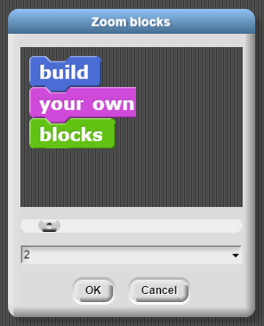

# Lesson 1.1: Welcome to Snap!

## Learning objectives

Students will be able to...

* Define and identify **blocks**, **scripts**, **sprites**, and **the stage** in Snap!.
* Write simple Snap! programs.
* Describe what simple Snap! programs do without executing the script.

## Materials/preparation

* [1.1 slide deck](https://github.com/TEALSK12/introduction-to-computer-science/raw/master/slidedecks/TEALS%20SNAP%201.1.pptx)
* [Unit 1 Do now](do_now_11.md)
* [Lab 1.1 handout - Welcome to Snap!](lab_11.md) ([docx](https://github.com/TEALSK12/introduction-to-computer-science/raw/master/Unit%201%20Word/Lab%201.1%20Welcome%20To%20SNAP.docx)) ([pdf](https://github.com/TEALSK12/introduction-to-computer-science/raw/master/Unit%201%20PDF/Lab%201.1%20Welcome%20To%20SNAP.pdf))
* [Helping trios activity](helping_trios.md)
* Read through the lab so that you are familiar with the requirements and can assist students as needed
* [Unit 1 tips](unit_1_tips.md)
* Video resource - [https://www.youtube.com/watch?v=b-EWj7xN90U](https://www.youtube.com/watch?v=b-EWj7xN90U)
  * Video quiz - See Additional Curriculum Materials accessed from the TEALS Dashboard.

## Pacing guide

| Duration   | Description                                   |
| ---------- | --------------------------------------------- |
| _Day 1_    |                                               |
| 10 minutes  | Welcome, attendance, Do Now, announcements |
| 10 minutes | Introductory discussion                       |
| 10 minutes | Lab walkthrough                               |
| 20 minutes | "Welcome to Snap!" Lab activity               |
| 5 minutes | Demonstrate turn-in procedures and wrap-up    |
| _Day 2_    |                                               |
| 5 minutes  | Welcome, attendance, bell work, announcements |
| 10 minutes | Review from yesterday                         |
| 30 minutes | Continue lab                                  |
| 10 minutes | Debrief, turn-in, and wrap-up                 |

## Using zoom blocks

Zoom blocks are a useful tool to increase the readability of code in Snap!. To access the zoom blocks feature, simply go up to settings in the upper left, and select the second option in the list, zoom blocks. Once selected, an interface pops up which allows you to increase the zoom on your code and shows you a preview.

## Instructor's notes

### Day 1

#### Introductory discussion

* Review the definitions of "algorithm" and "program" developed in lesson 0.2.
  * **Algorithm:** a complete, well-defined sequence of steps for completing a task or solving a problem.
  * **Program:** a sequence of instructions or steps, written in a language that can be understood by a computer, that will be used by the computer to complete a task or solve a problem.

#### Activity Walkthrough

* Work through [Lab 1.1](lab_11.md) up through part 3 (scripts) as a class.
* Point out key aspects of Snap! in each section, including:
  * the sections of the window in part 1.
  * block shapes and color-coding of categories in part 2.
  * simply draw attention to the different shapes at this point; their meanings will be covered as each block type is introduced.
  * the "drag-and-drop" nature of the language.
  * running blocks/scripts by clicking on them.
* Ensure that all students can create an account and save their work, as describe in the preamble of the lab
* Allow students a few minutes to develop their own answers to each of the questions and activities before discussing as a group.

#### Activity

* Individually or in pairs, have students continue working through the ["Welcome to Snap!"](lab_11.md) lab activity.  
  * If you choose to assign pairs, try to partner students into groups.
  * Try to pair students who do not normally interact.
  * Students should answer all questions and complete all activities and turn them in using your chosen turn-in procedure.
* For written questions, either have students hand-write answers and turn in the hard copies or set up an electronic submission system of some kind.
* For Snap! programs, including the Kaleidoscope program, students should save the program to the cloud and share a link with you.
* Students should aim to get through at least part 6 by the end of Day 1.
* Throughout the period, you can pause class to discuss each numbered part of the lab before moving on.
* Circulate while students are working and try to judge when most of the class has finished each part.
* Try to check in at least every 10 minutes.

#### Turn-in procedures

* Remind students of the turn in procedures introduced in Unit 0.

### Day 2

#### Review

* Go over answers to the questions from the parts of the lab completed on day 1 (ideally, at least through part 6).
* Include the parts completed as a class (parts 1-3).
* Ask questions along the way to assess students' understanding of concepts.  
* Consider the following questions:
  * Naming the parts of the Snap! window.
  * Defining "block," "reporter," "script," etc.
  * Describing the coordinate system used in Snap!.

#### Continue lab

* Students should continue working through the lab, aiming to finish all parts by the end of class
* As before, students should turn in all answers using your chosen turn-in procedure.
* Pause class at least once to verify understanding of parts 7 and 8 before students move on to the Kaleidoscope program.
* Judge the appropriate time based on observing student progress, but ensure that you break in with at least 10 minutes remaining so students have enough time to work through the program.

#### Debrief and wrap-up

* Discuss the challenges in the Kaleidoscope program.
* If time allows, ask one or two students to demonstrate their programs and describe their code.
* Remind students of the turn-in procedures discussed yesterday and ensure all students can turn in their work.

## BJC Lecture suggestions

### BJC video suggestion

* [BJC Lecture 2: 3D Graphics](http://www.youtube.com/watch?v=q2UMQaoW30U&t=16m50s)
* [Procedural Based Motion]( http://www.youtube.com/watch?v=q2UMQaoW30U&t=16m50s ) (Lab 1.1): 16:56-20:00

## Accommodations/differentiation

* For students that finish the lab early, encourage them to add more advanced features to their Kaleidoscope program, exploring parts of Snap! not covered in the lab.
* Students that are struggling with the lab can be paired up and/or receive individual instructor attention to help them through the activity.  You can also use [Helping trios activity](helping_trios.md)
* No parts of this lab can be easily skipped without impacting learning objectives, so provide as much support or scaffolding as you can to ensure all students can complete the lab.  Add days to the lesson if needed.
