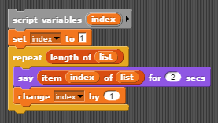

# Lesson 4.4: List Practice II

## Learning Objectives

Students will be able to...

-   Traverse a list, accessing each element one at a time
-   Perform operations combining all elements in a list
-   Select defined subsets of elements in a list

## Materials/Preparation

-   [Lab 4.4 handout (Number Cruncher)](lab_44.md) ([Download in Word](https://teals-introcs.gitbooks.io/introduction-to-computer-science-principles/content/Unit%204%20Word/Lab%204.4%20Number%20Cruncher.docx)) ([Link to PDF](https://teals-introcs.gitbooks.io/introduction-to-computer-science-principles/content/Unit%204%20PDF/Lab%204.4%20Number%20Cruncher.pdf))

## Pacing Guide

| Duration   | Description                                   |
| ---------- | --------------------------------------------- |
| 5 minutes  | Welcome, attendance, bell work, announcements |
| 10 minutes | Review and debrief lab 4.3                    |
| 25 minutes | Activity                                      |
| 15 minutes | Debrief and wrap-up                           |

## Instructor's Notes

-   Review
    -   Ask students to define "traversal" and outline the basic code pattern
        -   You need not write actual code here, but have students mention the key points (index variable, use index to access each item, repeat length of list, etc.)
    -   Review solutions to lab 4.3
        -   Ask a student to provide their solution to each part
        -   Discuss errors or flaws in each solution
        -   Point out similarities between each part, emphasizing that the basic code pattern is the same each time with only the operation performed on each item changing
            -   If you feel students can handle it, you can further classify various traversals (maps, filters, folds)
        -   If necessary, provide the basic code pattern for a traversal again:

            
-   Activity
    -   Students should complete the "Number Cruncher" lab individually
        -   The operations in this lab are fairly similar to those in lab 4.3, but work with lists of numbers instead of names.  As a result, students should progress more quickly. 
        -   As in lab 4.3, help students realize that the basic code pattern in each part will be the same.
-   Debrief
    -   Ask one or two students to share their solution to each part of the lab
        -   If all students seem to grasp the concept, not all parts need to be reviewed
        -   If skipping some parts, be sure to review at least parts 1.1 (a fold), 2.1 (a map) and 2.2 (a filter) 
    -   Point out that the solutions from labs 4.3 and 4.4 will look quite similar, even though in lab 4.3 the lists contained names in in lab 4.4 they contained numbers
        -   The traversal code pattern is the same regardless of the type of elements in the list

## Accommodations/Differentiation

-   Advanced students should complete both bonus parts of the lab (1.5 and 2.3) and then assist struggling students.
-   Students who need more assistance should focus on parts 1.3, 2.1, and 2.2.  Ensure that all students are able to complete at least these three parts before concluding the lesson.
