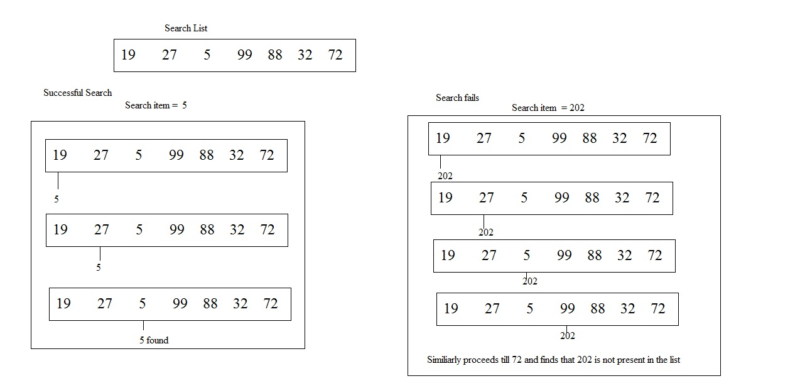

# Lesson 4.5: Sequential search

## Learning objectives

Students will be able to...

* Explain the sequential search algorithm.
* Implement several variations of sequential search.

## Materials and preparation

* [Do now 4.5: List tracing](do_now_45.md)
* [4.5 slide deck](https://github.com/TEALSK12/introduction-to-computer-science/raw/master/slidedecks/TEALS%20SNAP%204.5.pptx)
* [Lab 4.5 - It's around here somewhere](lab_45.md) ([docx](https://github.com/TEALSK12/introduction-to-computer-science/raw/master/Unit%204%20Word/Lab%204.5%20Its%20Around%20Here%20Somewhere.docx)) ([pdf](https://github.com/TEALSK12/introduction-to-computer-science/raw/master/Unit%204%20PDF/Lab%204.5%20Its%20Around%20Here%20Somewhere.pdf))
* [Snap! tips][]: 0, 19

## Pacing guide

| Duration   | Description                                   |
| :--------- | :--------------------------------------------- |
| 5 minutes  | Welcome, attendance, bell work, announcements |
| 15 minutes | Lecture and demonstration                     |
| 25 minutes | It's Around Here Somewhere Activity           |
| 10 minutes | Debrief and wrap-up                           |

## Instructor's notes

### Lecture

Ask students to consider how to determine if a particular person is in the room or not.

At first, you will likely get answers like "call out the person's name" or "look around."  Press the students to come up with a method that will always work, including when the person is not present.  If necessary, ask them to pretend they are a computer.

Point out that solutions like "look around" are too high-level, and in reality, there is a lot more going on (such as looking at each person individually).

Guide students to the process of checking if each person is the one they are seeking, in some deterministic order, until they have either found the person or checked everyone.  Emphasize that the absence of the person is only confirmed when everyone has been checked, but that the presence is known as soon as the person is found.

Ensure students recognize that this process is a traversal of the people in the room.

Explain that the process of traversing a list looking for a particular item is known as a "sequential search."

Ask students to think about the efficiency of this algorithm.  Emphasize best, worst, and average cases (both what those cases are and how long they take).

Students should have a basic understanding of the fact that the speed of the search is dependent on the size of the list.

* If students seem prepared, ask them to speculate under what circumstances you might be able to do better (eventually leading to binary search).

Show the script for a basic sequential search:
  

Point out that this script is another variation of a traversal.

Emphasize that this is only one variant of sequential search.  The specifics of what to report can vary (true/false, index in list, item itself, etc.).

### Activity

Students should complete the [It's around here somewhere](lab_45.md) activity individually or in pairs.

* Each part asks students to write a slightly different sequential search.  In all cases, make sure students are clear on what they should be reporting, both when the desired item is found and when it is not.

### Debrief

Ask one or two students to provide their solutions to each part.

Point out the similarities in each solution, emphasizing that the algorithm remains constant and only the value that is reported changes.

## Accommodations and differentiation

Advanced students can be encouraged to explore more efficient searching algorithms (specifically binary search).

Struggling students should focus on just parts 1.1 and/or 2.1 of the lab.  Remind these students that they are starting with a traversal and simply changing what happens to each item.

[Snap! tips]: https://github.com/TEALSK12/introduction-to-computer-science/blob/master/Snap%20Tips.docx?raw=true
